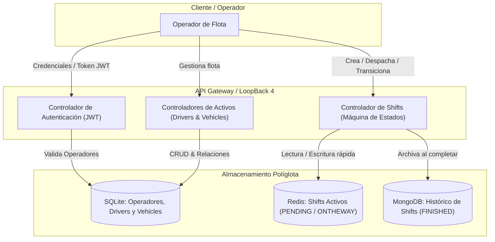

# Arquitectura del Dominio y Modelo de Datos

Este documento define el planteamiento funcional, técnico y arquitectónico de la aplicación **Simple Taxi Fleet Simulator** en **LoopBack 4**.

---

## 1. Visión General del Sistema

La aplicación gestiona una flota de taxis orientada a **Operadores de Flota**, coordinando activos fijos (conductores y vehículos), la asignación de trayectos/turnos (*shifts*) en tiempo real y el archivo histórico de operaciones para analítica y auditoría.

---

## 2. Autenticación y Usuarios (Operadores de Flota)

* **Rol**: Operador de flota (*Dispatcher*).
* **Mecanismo**: Autenticación basada en tokens JWT (`@loopback/authentication`, `@loopback/authentication-jwt`).
* **Flujo**:
  1. El operador envía credenciales (`email` / `password`).
  2. El sistema valida el hash (bcrypt) contra la base de datos relacional.
  3. Se emite un token JWT que el operador debe incluir en la cabecera `Authorization: Bearer <token>` para consumir los endpoints protegidos.
* **Persistencia**: **SQLite** (tabla `User` / `UserCredentials`).

---

## 3. Activos del Negocio: Drivers y Vehicles (SQLite)

### ¿Por qué SQLite para Drivers y Vehicles?
1. **Integridad Referencial y Relacional**: Existe una relación directa entre conductor y vehículo (1:1 o 1:N según asignación de turnos). Las bases de datos relacionales garantizan claves foráneas, restricciones de unicidad (p. ej. matrícula o número de licencia únicos) y transacciones ACID.
2. **Bajo costo operacional en local**: No requiere un contenedor ni servicio externo para desarrollo o simulación.
3. **Modelado en LoopBack 4**: Permite utilizar `DefaultCrudRepository`, decoradores `@hasOne`, `@belongsTo` y migraciones automáticas (`npm run migrate`).

### Definición de Entidades

#### `Driver`
* `id`: Identificador único (UUID o autoincremental).
* `name`: Nombre completo del conductor.
* `assignedVehicleId`: Referencia foránea opcional a `Vehicle`.
* `status`: Estado operativo (`AVAILABLE`, `ON_DUTY`, `OFF_DUTY`).

#### `Vehicle`
* `id`: Identificador único.
* `plate`: Matrícula del vehículo (única).
* `licenseNumber`: Número de licencia de taxi (única).
* `assignedDriverId`: Referencia foránea al conductor actual.
* `position`: Coordenadas geográficas (`latitude`, `longitude`).
* `status`: Estado del vehículo (`AVAILABLE`, `IN_SERVICE`, `MAINTENANCE`).

---

## 4. Entidad `Shift` en Tiempo Real (Redis)

### ¿Por qué Redis para Shifts Activos?
1. **Volatilidad y Tiempo Real**: Un trayecto/servicio activo experimenta cambios rápidos de estado (`PENDING` ➔ `ONTHEWAY` ➔ `FINISHED`) y consultas concurrentes de alta frecuencia con latencias sub-milisegundo.
2. **TTL y Expiración**: Permite configurar tiempos de expiración automáticos si un servicio en estado `PENDING` no es aceptado por ningún conductor tras un umbral de tiempo.
3. **Separación de responsabilidades (CQRS / Fast Path)**: Mantiene la base de datos histórica limpia de estados intermedios y cancelaciones efímeras.
4. **Valor educativo**: Permite aprender a configurar un `KeyValueDataSource` o cliente Redis en LoopBack 4 y orquestar transiciones entre diferentes motores de almacenamiento.

### Propiedades de `Shift`
* `id`: Identificador único del servicio.
* `clientName`: Nombre del cliente que solicita el servicio.
* `from`: Ubicación de origen.
* `to` *(opcional al crear)*: Destino del servicio.
* `date`: Fecha y hora de solicitud.
* `status`: Estado actual:
  * `PENDING`: Servicio solicitado pero aún no en curso hacia el destino.
  * `ONTHEWAY`: Conductor en camino con el cliente a bordo.
  * `FINISHED`: Servicio finalizado.
* `acceptedBy`: Identificador del conductor o vehículo que tomó el servicio.

### Reglas de Negocio y Transiciones de Estado
* **Creación (`PENDING`)**: Puede omitirse el valor `to` (por ejemplo, el cliente sube y no ha indicado destino final).
* **Transición `PENDING` ➔ `ONTHEWAY`**: **Validación obligatoria**. Si el campo `to` no existía, el payload de la transición debe incluirlo obligatoriamente; de lo contrario, la API devolverá un error de validación `422 Unprocessable Entity` o `400 Bad Request`.
* **Transición `ONTHEWAY` ➔ `FINISHED`**: Dispara la persistencia en MongoDB y la eliminación/archivo del registro activo en Redis.

---

## 5. Histórico de Shifts (MongoDB)

### ¿Por qué MongoDB para el Histórico?
1. **Documentos Autocontenidos (Snapshots Históricos)**: En analítica y auditoría, el registro de un servicio completado debe conservar los datos exactos del momento en que ocurrió (datos del cliente, conductor, matrícula del vehículo en ese instante, ruta y tiempos). En Mongo se desnormaliza en un documento único inmutable sin riesgo de que futuras modificaciones en SQLite corrompan el histórico.
2. **Consultas de Agregación**: Excelente para métricas de flota: tiempos medios de servicio, volumen de trayectos por conductor, mapas de calor por zonas.
3. **Escalabilidad de Lectura/Escritura Masiva**: Diseñado para albergar millones de registros históricos sin degradar el rendimiento relacional de SQLite.

---

## 6. Resumen de Persistencia Políglota

| Componente | Motor de Datos | Conector / Herramienta | Rol Arquitectónico |
| :--- | :--- | :--- | :--- |
| **Operadores (Users)** | SQLite | `loopback-connector-sqlite3` | Credenciales y control de acceso seguro |
| **Activos (Drivers & Vehicles)** | SQLite | `loopback-connector-sqlite3` | Datos maestros con integridad referencial |
| **Shifts Activos** | Redis | `ioredis` / `@loopback/repository` KV | Estado efímero de alta velocidad y TTL |
| **Histórico de Shifts** | MongoDB | `loopback-connector-mongodb` | Archivo inmutable, agregaciones y auditoría |
