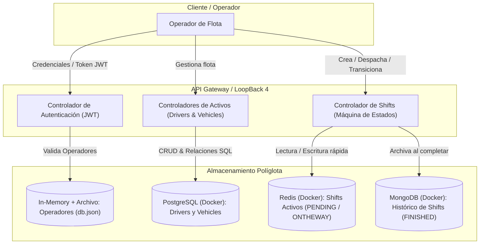

# Arquitectura del Dominio y Modelo de Datos

Este documento define el planteamiento funcional, técnico y arquitectónico de la aplicación **Simple Taxi Fleet Simulator** en **LoopBack 4**.

---

## 1. Visión General del Sistema

La aplicación gestiona una flota de taxis orientada a **Operadores de Flota**, coordinando activos fijos (conductores y vehículos), la asignación de trayectos/turnos (*shifts*) en tiempo real y el archivo histórico de operaciones para analítica y auditoría.

---

## 2. Autenticación y Usuarios (Operadores de Flota) — *In-Memory (`data/db.json`)*

* **Rol**: Operador de flota (*Dispatcher*).
* **Mecanismo**: Autenticación basada en tokens JWT (`@loopback/authentication`, `@loopback/authentication-jwt`).
* **Flujo**:
  1. El operador envía credenciales (`email` / `password`).
  2. El sistema valida el hash de contraseña (bcrypt) contra el repositorio de usuarios.
  3. Se emite un token JWT que el operador debe incluir en la cabecera `Authorization: Bearer <token>` para consumir los endpoints protegidos.
* **Persistencia**: **In-memory db con persistencia local a archivo** (`./data/db.json`).
  * Conector: `memory` (oficial de StrongLoop / LoopBack 4).
  * Ideal para almacenar operadores y credenciales locales de forma aislada, portable y sin requerir infraestructura adicional.

---

## 3. Activos del Negocio: Drivers y Vehicles — *PostgreSQL (Docker)*

### ¿Por qué PostgreSQL para Drivers y Vehicles?
1. **Motor Relacional Empresarial**: Implementa integridad referencial estricta, claves foráneas, índices de unicidad (`plate`, `licenseNumber`), transacciones ACID y tipos numéricos de alta precisión para geolocalización.
2. **Soporte Oficial LoopBack 4**: Utiliza `loopback-connector-postgresql`, el conector relacional más maduro y soportado activamente por StrongLoop.
3. **Práctica Profesional**: Permite trabajar con esquemas SQL estándar y migraciones automáticas (`npm run migrate`).
4. **Infraestructura Contenedorizada**: Se ejecuta en un contenedor Docker orquestado con `docker-compose.yml`.

### Definición de Entidades

#### `Driver`
* `id`: Identificador numérico autoincremental (`id: true, generated: true`).
* `name`: Nombre completo del conductor (`string, required: true`).
* `assignedVehicleId`: Clave foránea al vehículo asignado (`number, optional`).
* `status`: Estado operativo (`AVAILABLE`, `ON_DUTY`, `OFF_DUTY`).

#### `Vehicle`
* `id`: Identificador numérico autoincremental.
* `plate`: Matrícula del vehículo (`string, required: true, unique`).
* `licenseNumber`: Número de licencia del taxi (`string, required: true, unique`).
* `assignedDriverId`: Clave foránea al conductor asignado (`number, optional`).
* `latitude` / `longitude`: Coordenadas geográficas (`number, optional`).
* `status`: Estado operativo (`AVAILABLE`, `IN_SERVICE`, `MAINTENANCE`).

---

## 4. Entidad `Shift` en Tiempo Real — *Redis (Docker)*

### ¿Por qué Redis para Shifts Activos?
1. **Volatilidad y Tiempo Real**: Los trayectos activos cambian velozmente (`PENDING` ➔ `ONTHEWAY` ➔ `FINISHED`) con lecturas y escrituras concurrentes sub-milisegundo.
2. **Expiración y TTL**: Permite descartar automáticamente servicios `PENDING` si ningún conductor los acepta tras cierto tiempo límite.
3. **Conector Oficial**: `loopback-connector-kv-redis` o cliente `ioredis` inyectado en el contexto de LoopBack.

### Propiedades de `Shift`
* `id`: Identificador único (`number` o `string` UUID).
* `clientName`: Nombre del cliente (`string, required: true`).
* `from`: Ubicación de origen (`string, required: true`).
* `to` *(opcional al crear)*: Destino del servicio.
* `date`: Fecha y hora de solicitud (`date, defaultFn: 'now'`).
* `status`: Estado del trayecto (`PENDING`, `ONTHEWAY`, `FINISHED`).
* `acceptedBy`: ID del conductor/vehículo que tomó el servicio (`number, optional`).

### Reglas de Negocio y Transiciones de Estado
* **Creación (`PENDING`)**: Puede omitirse el valor `to`.
* **Transición `PENDING` ➔ `ONTHEWAY`**: **Validación obligatoria**. Si el campo `to` no existía, el payload de transición debe incluirlo obligatoriamente (de lo contrario, error `422 Unprocessable Entity`).
* **Transición `ONTHEWAY` ➔ `FINISHED`**: Dispara la persistencia en MongoDB y la eliminación/archivo del registro activo en Redis.

---

## 5. Histórico de Shifts — *MongoDB (Docker)*

### ¿Por qué MongoDB para el Histórico?
1. **Snapshots Históricos Inmutables**: Cuando un servicio termina, el registro en MongoDB consolida un documento JSON con la información exacta del servicio (datos del cliente, conductor, matrícula del vehículo en ese instante, tiempos y ruta). No se ve afectado si en el futuro se modifican registros en PostgreSQL.
2. **Consultas de Agregación**: Excelente para analítica de negocio (duración media de viajes, cálculo de volumen por zonas).
3. **Conector Oficial**: `loopback-connector-mongodb` (soportado por StrongLoop).

---

## 6. Resumen de Persistencia Políglota e Infraestructura

| Componente | Motor de Datos | Conector LoopBack 4 | Despliegue | Rol Arquitectónico |
| :--- | :--- | :--- | :--- | :--- |
| **Operadores (`User`)** | In-Memory con archivo | `memory` (`./data/db.json`) | Local embebido | Credenciales y autenticación JWT |
| **Activos (`Driver`, `Vehicle`)** | PostgreSQL | `loopback-connector-postgresql` | Contenedor Docker | Datos maestros relacionales con ACID |
| **Shifts Activos** | Redis | `loopback-connector-kv-redis` / `ioredis` | Contenedor Docker | Estado efímero de alta velocidad y TTL |
| **Histórico de Shifts** | MongoDB | `loopback-connector-mongodb` | Contenedor Docker | Archivo inmutable, agregaciones y auditoría |
